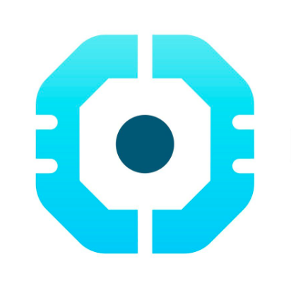

<div style="display:flex; align-items: center">
  <h1 style="position:relative; top: -6px" >Epic Movie Quotes API</h1>
</div>

Epic Movie Quotes API is built on Laravel and it serves as the backend for the Epic Movie Quotes application, providing a seamless and efficient way to interact with movie-related data.

With the Epic Movie Quotes API, developers can access a wide range of endpoints to perform various operations. These include user authentication and authorization (including Google OAuth), allowing users to register, login, and manage their accounts securely. The API also offers endpoints for retrieving movie information, adding new movies, and performing CRUD operations on quotes and movies. It leverages Laravel's robust features such as routing, middleware, and database integration to ensure reliable and efficient data management. It also incorporates data validation and error handling to maintain the integrity of the API.

#

### Table of Contents

-   [Prerequisites](#prerequisites)
-   [Tech Stack](#tech-stack)
-   [Getting Started](#getting-started)
-   [Migration and Populating Database](#migration-and-populating-database)
-   [Development](#development)
-   [Project Structure](#project-structure)

#

### Prerequisites

-    PHP@8.2 and up
-    MYSQL@8 and up
-    npm@8.19 and up
-    composer@2 and up
-    Laravel@10 and up

#

### Tech Stack

-    [Laravel@10.x](https://laravel.com/docs/10.x) - Back-end Framework
-    [Laravel Sanctum@3.x](https://laravel.com/docs/10.x/sanctum) - Authentication System
-    [Laravel Socialite@5.x](https://laravel.com/docs/10.x/socialite) - OAuth Authentication
-    [Pusher@7.x](https://pusher.com/) - Real-time messaging and event-driven platform

#

### Getting Started

1\. First of all you need to clone Epic Movie Quotes API repository from github:

```sh
git clone https://github.com/RedberryInternship/elene-metreveli-epic-movie-quotes-back
```

2\. Next step requires you to run _composer install_ in order to install all the dependencies.

```sh
composer install
```

#

### Migration and Populating Database

Migration is a fairly simple process, just execute

```sh
php artisan migrate
```

Populate the database with genres

```sh
php artisan db:seed --class=GenreSeeder
```

Populate the database with the sample data

```sh
php artisan db:seed
```

Prepare your .env file and provide the environment values

```sh
cp .env.example .env
```

### Development

You can run Laravel's built-in development server by executing:

```sh
  php artisan serve
```

### Project Structure

```bash
├─── app
│   ├─── Events
│   │    ├── CommentUpdated.php
│   │    ├── LikeUpdated.php
│   │    └── NotificationUpdated.php.php
│   ├─── Http
│   ├─── Models
│   │    ├── Comment.php
│   │    ├── Genre.php
│   │    ├── Like.php
│   │    ├── Movie.php
│   │    ├── Notification.php
│   │    ├── Quote.php
│   │    └── User.php
│   ├─── Providers
│   │    ├── AuthServiceProvider.php
│   │    ├── BroadcastServiceProvider.php
│   │    └── PasswordResetServiceProvider.php
├─── bootstrap
├─── config
│   │    ├── Broadcasting.php
│   │    ├── Sanctum.php
│   │    └── Services.php
├─── database
├─── lang
│   ├── en
│   └── ka
├─── lang
├─── public
├─── resources
├─── routes
├─── storage
├─── tests
- .env
- artisan
- composer.json
- package.json
- tailwind.config.json
- vite.config.json
```

Project structure is fairly straitforward

For more information about project standards, take a look at these docs:

-   [Laravel](https://laravel.com/docs/10.x/)

#

### Database Design Diagram


#
